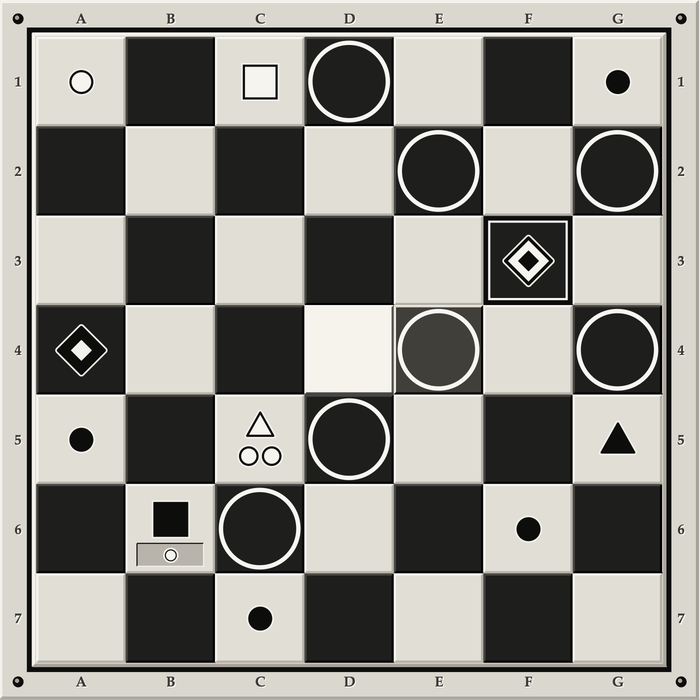

# Royals

A two-player abstract strategy game, and the engine that plays it.

Seven-by-seven, wrapping at the edges. Each side has a royal, four pawns, a spy and a
dragon. Squares are stacks, stacks take prisoners, and you win by gathering your spy,
your four pawns and your royal onto a single square. No dice, no hidden cards — both
players can see everything, and every position has a best move whether or not anyone
finds it.



**[Read the rules →](docs/RULES.md)**  ·  **[How it's built →](docs/ARCHITECTURE.md)**  ·
**[Working on it →](CONTRIBUTING.md)**

## Layout

```
engine/src/royals_engine/   the game itself — no UI, no dependencies
  hasher.py                 board representation: 49 ints, 13 bits each
  engine.py                 move generation, validation, execution, ko
  ai.py                     alpha-beta search
  notation.py               moves and boards as text and JSON — the only module
                            allowed to know how a move is packed
  perlin.py                 noise, used only to vary the computer's opening
  compat.py                 two helpers that outlived the legacy RoyalsLib

apps/desktop/royals_gui.py  tkinter window, with a hand-rolled 3D board
apps/terminal/main_play.py  the same game in a terminal
  display.py                ANSI board rendering (was in Hasher)
  prompt.py                 the "which square?" prompt (was Engine.getOrigin)
  royals_lib.py             frozen Python-2-era original, kept for the terminal driver

web/src/royals_web/         FastAPI server — REST API and a browser client
  main.py                   routing and request limits: who may ask
  game.py                   game state and move validation: what is legal
  ai_pool.py                process pool, concurrency cap, per-search deadline
  store.py                  in-memory game store, bounded and TTL'd
  static/                   the browser client — index.html, app.js, board.js, style.css

tests/regress.py            the regression harness
tests/golden.txt            the rules contract — see below
docs/                       the rulebook and the architecture notes
Backup/                     frozen Python-2-era originals, kept as the historical record
```

## Installing it

To just play the game on a Mac or a Linux box, there is an installer. Download it, read it —
it is short, and you should never run a script off the internet you haven't looked at — then
run it:

```bash
curl -fsSLO https://raw.githubusercontent.com/NotQuiteCosmic/royals/master/install-desktop.sh
less install-desktop.sh
sh install-desktop.sh
```

Or, if you'd rather not:

```bash
curl -fsSL https://raw.githubusercontent.com/NotQuiteCosmic/royals/master/install-desktop.sh | sh
```

It clones the game to `~/Royals`, writes a launcher next to it, and on macOS builds
`~/Applications/Royals.app` so it's double-clickable. Then it opens the window.

It **installs no Python packages** — no pip, no virtualenv, nothing added to your system
Python. It doesn't need to: `royals_engine` imports the standard library and nothing else,
so the launcher just puts `engine/src` on `PYTHONPATH`. It writes to those two paths in your
home directory and nowhere else, needs no sudo, and refuses to run with it. Pass
`--dry-run` to see exactly what it would do without it doing anything.

It won't overwrite things it didn't create: if `~/Royals` is already something else, or if
an `Royals.app` is there that this installer didn't build, it stops and says so rather than
clearing the way. Run it again any time to update — a checkout with local edits is left
alone, not overwritten.

To remove it, `sh ~/Royals/uninstall.sh`, or delete `~/Royals` and `~/Applications/Royals.app`
by hand. That's all there is.

The installer covers the desktop window only. For the terminal and browser front ends, and
for working on any of it, carry on below.

## Running it

```bash
python3 -m pip install -e ./engine        # once

python3 apps/desktop/royals_gui.py                 # the window
cd apps/terminal && python3 main_play.py           # the terminal
cd tests && python3 regress.py check all           # the tests
```

And the server, which needs its own install because it has dependencies the engine
deliberately doesn't:

```bash
python3 -m pip install -e ./web
python3 serve.py                    # starts it and opens your browser
```

`serve.py` is a thin wrapper around uvicorn that handles the two things which otherwise
look like the app being broken: **uvicorn never opens a browser** — it only listens and
prints a URL — and if the port is taken it exits with `[Errno 48] Address already in
use`, which reads like a crash rather than a second copy declining to start. The wrapper
opens the page for you and steps to the next free port instead of failing.

To run uvicorn directly, that is still fine — just visit the URL yourself:

```bash
cd web && python3 -m uvicorn royals_web.main:app --reload    # then open http://127.0.0.1:8000/
```

If a stale server is holding the port:

```bash
lsof -nP -iTCP:8000 -sTCP:LISTEN     # find it
```

## golden.txt is the contract

`tests/golden.txt` records, from a spread of reachable positions, **every legal move
both sides have, the board each one produces, and what the evaluator thinks the result
is worth.** 13,496 lines of it. It says nothing about how any of that is computed — only
what the rules do — which is why it survived the rewrite from the original
variable-length bit encoding to the packed integers used today.

So the rule is simple:

> **A change to the engine that leaves `golden.txt` byte-identical is provably
> behaviour-preserving. A change that moves it needs a reason.**

That single property is what makes this codebase safe to refactor, and it is why the
engine was carved into an importable package without anyone having to re-read a
thousand lines of move generation and hope.

`golden_search.txt` is different and is *expected* to churn: it records node counts per
move, so it moves whenever the tree is walked differently — often for a perfectly good
reason. Re-recording it is normal. Re-recording `golden.txt` is not.

```bash
cd tests
python3 regress.py check all     # verify
python3 regress.py write search  # re-record just the search baseline
```

## Why the engine has no dependencies

`royals-engine` imports nothing but the standard library, and
`tests/test_engine_purity.py` fails the build if that stops being true — or if anything
in the engine imports tkinter, calls `input()`, or prints.

This is not tidiness. The same modules need to run in a tkinter window, in a terminal, in
a web worker serving many games at once, and eventually in a browser under Pyodide. A
module that prints to stdout or blocks on stdin has decided which of those it is. It is
also a security property: no third-party code sits in the path that validates a move.

The engine targets **Python ≥ 3.10**, not 3.12, so it keeps running under PyPy — several
times faster on this search, and the intended interpreter for the server's AI worker.
Scores are computed in integers rather than floats for a related reason: CPython and PyPy
once disagreed in the last decimal place on a square root, which flipped an alpha-beta
cutoff and changed the move played. CI runs the goldens under both.

## The server never trusts the board

The web layer rests on one rule: **the board never travels from the client to the
server.** A move request carries a kind, an origin, a destination and a prisoner flag —
four small values — and the server loads the position from its own store and
independently regenerates every legal move before accepting one.

`AI.listAllMoves` is the same generator the computer plays by, so a person and the machine
are held to literally the same rules, and "is this legal?" is a tuple membership test
rather than a second, subtly different implementation of the rulebook.

## Status

| Part | State |
|---|---|
| Engine | Working. Both goldens green under CPython and PyPy. |
| Desktop (tkinter) | Working. |
| Terminal | Working. |
| Web API + client | Working; games are in memory only, so they don't survive a restart. |
| Tests | 95 altogether: 22 engine-purity, 51 notation, 22 web API. |
| Accounts, persistence | Not started. `store.py` is the seam Postgres goes behind. |
